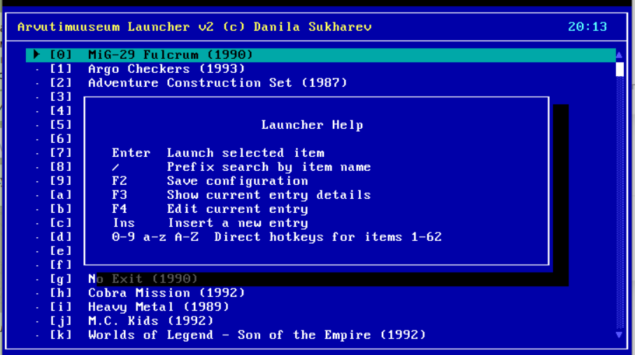

# aml2

`aml2` is a small DOS launcher.

It uses a tiny custom text UI, a supervisor stub (`AML.COM`), and a simple `LAUNCHER.CFG` format.

The main launcher list is rendered in a custom VGA text-mode big font. It shows 10 entries per page, using 2 text rows per game name.

## Screenshot



## What It Does

- shows entries from `LAUNCHER.CFG`
- launches the selected item through `AML.COM`
- supports viewer mode through `AML.COM`
- supports editor mode with `AML.COM /E`
- writes `AML2.RUN` as the handoff file between launcher and stub

Current output sizes from `./tools/build.sh` are approximately:

- `amlui.exe`: 32 KB
- `aml.com`: 1295 bytes

## Quick Start

Build:

```bash
./tools/setup_openwatcom.sh
./tools/build.sh
```

Normal DOS-side entrypoint:

```text
AML.COM
```

Do not start with `AMLUI.EXE` in normal use. `AML.COM` is the public entrypoint and relaunches the launcher after a game exits.

Expected DOS-side files:

- `AML.COM`
- `AMLUI.EXE`
- `LAUNCHER.CFG`
- the executables or batch files referenced by `LAUNCHER.CFG`

## Command Line

`AML.COM` supports:

- no args to start in viewer mode
- `/E` to start in editor mode

`AMLUI.EXE` supports:

- `/V` to enter viewer mode explicitly
- `/E` to enable editor mode
- `/S` to enable supervised mode (passed automatically by `AML.COM`; required for game launching)
- `/?` to print usage and exit

Direct `AMLUI.EXE` runs require an explicit mode. Mutation actions are only available in editor mode, and game launches are only enabled when `AMLUI.EXE` was started through `AML.COM` (or with `/S` explicitly).

## Config Format

`LAUNCHER.CFG` format:

```text
Name|Command|Working Directory
Name|Command|
```

Rules:

- lines starting with `#` are comments
- blank lines are ignored
- surrounding whitespace is trimmed
- `name` and `command` are required
- `path` is optional, but the trailing `|` is always required

## Controls

- `Up/Down`: move by one entry
- `PgUp/PgDn`: move by one visible page
- `Home/End`: jump to first or last entry
- `/`: search within entry names
- `Enter`: launch current selection
- `F1` or `?`: help
- `F3`: details
- `F9`: debug run menu with stub, direct-child, and shell launch options
- `F10`: exit to DOS

Editor mode only:

- `F2`: save `LAUNCHER.CFG`
- `F4`: edit current entry
- `F5` / `F6`: move current entry up or down
- `Ins`: insert a new entry
- `F8`: delete current entry

## Packaging

```bash
./tools/package_dist.sh
```

This creates:

- `out/dist/aml2-local.zip` locally
- `out/dist/aml2-<short-hash>.zip` in CI

The zip contains:

- `README.md`
- `LAUNCHER.CFG`
- `AMLUI.EXE`
- `AML.COM`

## Manual QEMU Run

```bash
./tools/run_qemu_manual.sh
```

To boot with a specific launcher config:

```bash
./tools/run_qemu_manual.sh path/to/LAUNCHER.CFG
```

To copy extra DOS files onto the floppy image before boot:

```bash
./tools/run_qemu_manual.sh path/to/GAME.EXE path/to/EXTRA.BAT
```

## Tests

Main checks:

```bash
bash tests/run_all.sh
```

Targeted runners are also available:

```bash
bash tests/run_host.sh
bash tests/run_dos_ui.sh
bash tests/run_dos_launch.sh
```

QEMU is the authoritative path for the launcher UI and stub loop. `kvikdos` is only used for fast non-TUI smoke checks in the DOS launch suite.

See [docs/stub-design.md](docs/stub-design.md), [docs/e2e-findings.md](docs/e2e-findings.md), [docs/design.md](docs/design.md), and [docs/toolchain.md](docs/toolchain.md) for implementation details.

## License

MIT. See [LICENSE](LICENSE).
